# React Native Base Snippets README

Automatically adds React Native Base snippets to your React Native Apps. 
+ Required Expo 32 and Above and React Native 0.59

## Features

Supported languages (file extensions)

JavaScript (.js)
JavaScript React (.jsx)
JavaScript React Native(.jsx)
TypeScript (.ts)
TypeScript React (.tsx)

## Snippets Info

Basic Methods

`!rnbaccordian` ===>  

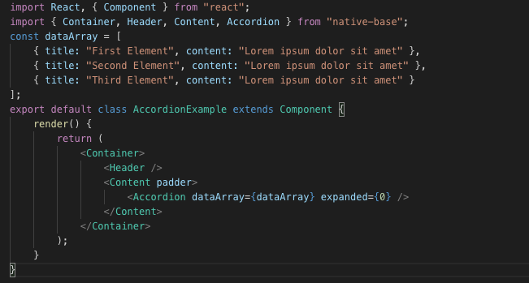

`!rnbbadge` ===>  

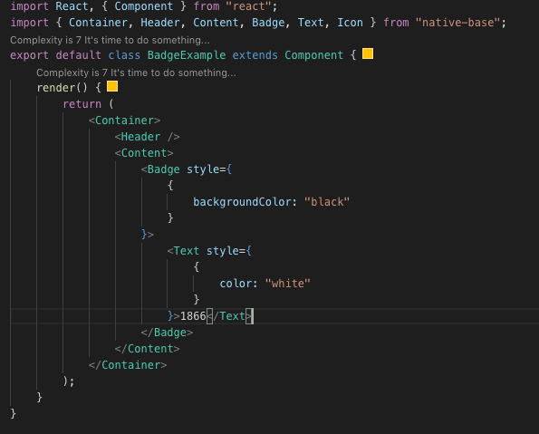

`!rnbbutton` ===>  

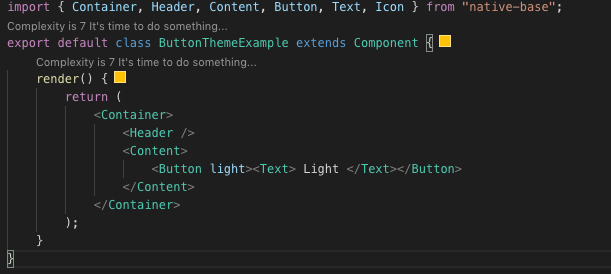

`!rnbcard` ===>  

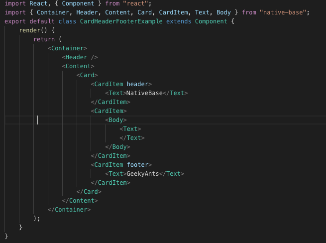

`!rnbcheckbox` ===>  

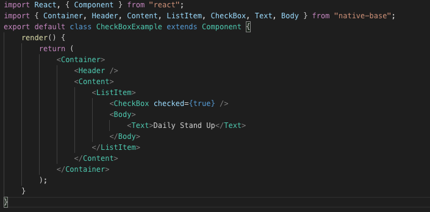

`!rnbadatepicker` ===>  

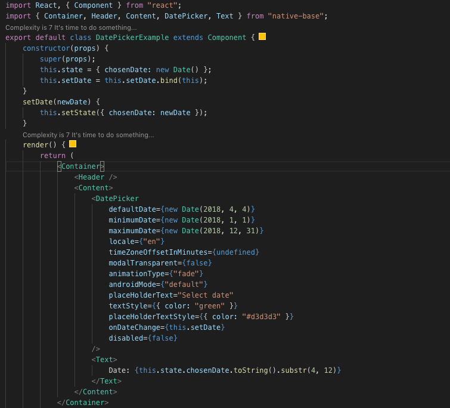

`!rnbform` ===>  

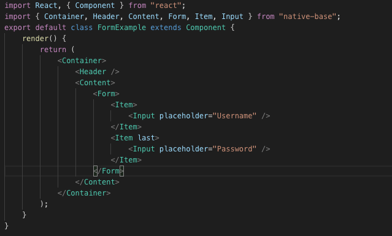

`!rnbheader` ===>  

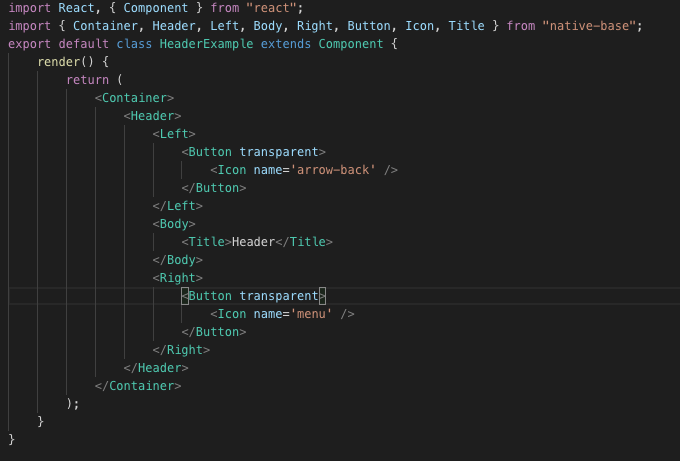

`!rnblist` ===>  

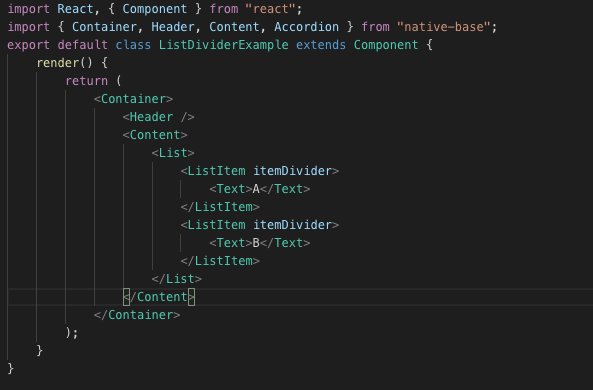

`!rnbpicker` ===>  

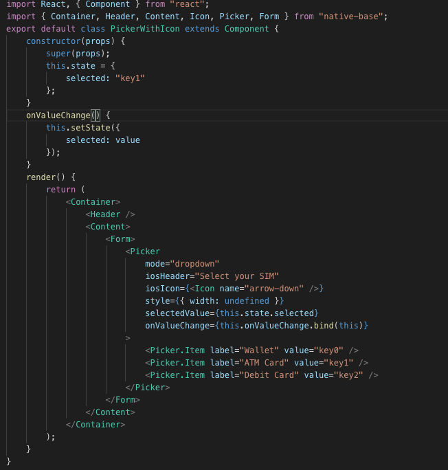

`!rnbradio` ===>  

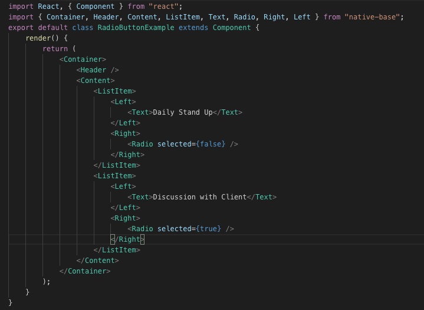

`!rnbasearchbar` ===>  

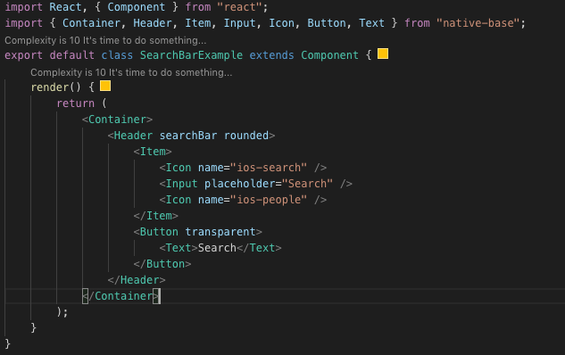

## Extension Settings

Include if your extension adds any VS Code settings through the `contributes.configuration` extension point.

For example:

This extension contributes the following settings:

* `myExtension.enable`: enable/disable this extension
* `myExtension.thing`: set to `blah` to do something

## Known Issues

Calling out known issues can help limit users opening duplicate issues against your extension.

## Release Notes

### 1.0.0

Initial release of React Native Base Snippets

-----------------------------------------------------------------------------------------------------------
**Enjoy!**
